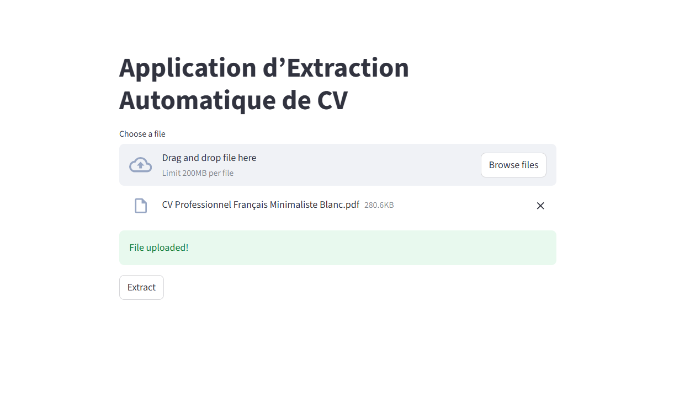
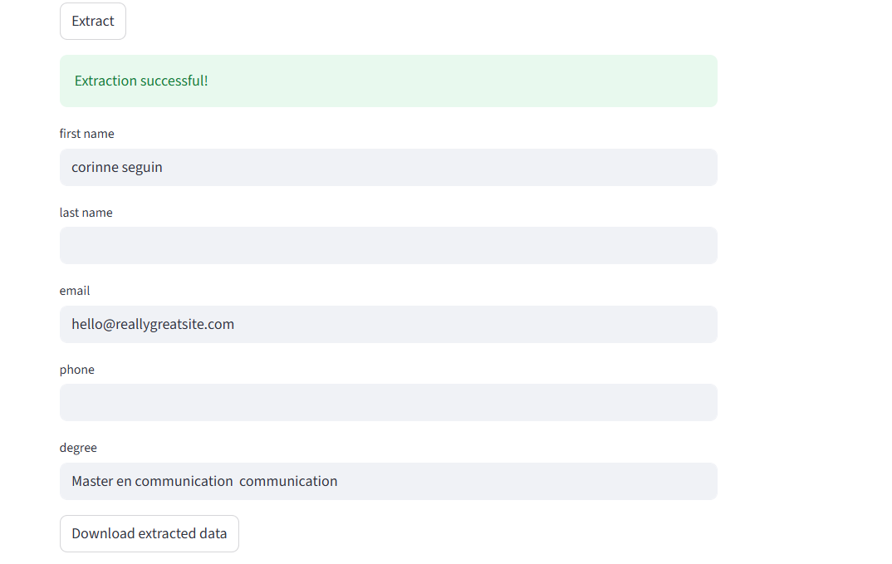
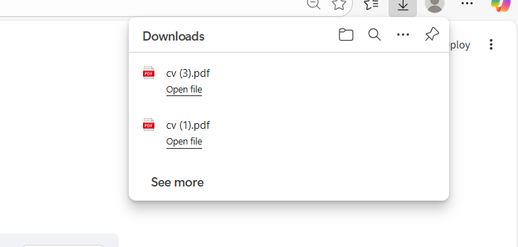

# Extractor_CV
Installation: 
 pip install streamlit fastapi uvicorn pydantic pdfplumber python-docx spacy
Lancement local:
 Backend:
   python -m uvicorn backend.main:app --reload
 Frontend:
  streamlit run app.py
Lancement Docker:

exemples d’API: 
 

  

  

  

 
      
